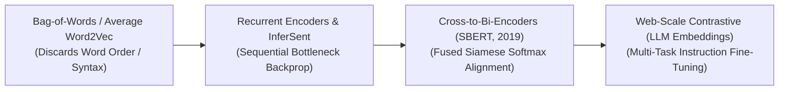

# Awesome-Sentence-Embeddings
## Sentence Embeddings: Evolution, Variants, Types, & Applications

Sentence Embedding is a foundational Natural Language Processing (NLP) paradigm that maps variable-length sequences of text—such as phrases, sentences, or full paragraphs—into a fixed-size, continuous vector space. While word embeddings capture the isolated semantic coordinates of independent tokens (e.g., mapping `king` and `queen`), sentence embeddings map complete compositional contexts, structural syntax layouts, and logical premises. By converting textual syntax into high-dimensional geometric coordinates (dense vectors), sentence embeddings enable computers to calculate mathematical distance scores (such as Cosine Similarity) to execute semantic search, document clustering, and information retrieval instantly.

---

## 1. The Chronological Evolution

The technical implementation of sentence-level mapping has transitioned from naive unigram word-vector averaging to recurrent sequential tracking, deep cross-encoder checkpoints, and modern contrastive bi-encoder transformers.

*   **The Flat Aggregation Era (Bag-of-Words & Vector Averaging, ~2013–2016)**
    *   *Concept:* The early baseline. Sentences were processed by calculating a flat algebraic average of the individual word embedding vectors (e.g., using Word2Vec or GloVe) inside the phrase.
    *   *Limitation:* Discarded word order, grammar syntax, and logical flow completely. Under this paradigm, the sentence `"No entry, safety clear"` would calculate an almost identical spatial coordinate vector to `"Clear entry, no safety"`, leading to massive semantic errors.
*   **The Sequential Recurrent & Supervised Task Era (~2016–2019)**
    *   *Concept:* Unlocked by deep sequence networks. Architectures like **InferSent (2017)** and Skip-Thought vectors trained deep Recurrent Neural Networks (LSTMs) or early Transformers over specialized supervised datasets like Natural Language Inference (NLI). The model learned to pass sequential information forward, capturing word relationships across a global time-horizon.
    *   *Limitation:* Heavy memory-bandwidth bottlenecks. Recurrent steps could not parallelize efficiently across GPU clusters during training, capping the length of text the system could ingest safely.
*   **The Siamese Bi-Encoder Transformer Revolution (SBERT, Reimers & Gurevych, 2019)**
    *   *Concept:* Solved the immense execution latency of early multi-pass Transformer architectures. SBERT (**Sentence-BERT**) paired twin, identical BERT models inside a **Siamese Network configuration**. It passed sentence A and sentence B through the separate text encoders in parallel, using a customized contrastive pooling layer to optimize cosine similarity directly over text pairs.
    *   *Significance:* Dropped semantic search time over 10 million sentences from 65 hours (using cross-attention brute-force models) down to **less than 5 milliseconds**, standardizing real-world production vector search infrastructure.
*   **The Multi-Task Instruction-Tuned & LLM Backbone Era (~2023–Present)**
    *   *Concept:* The modern state-of-the-art framework. Moves past rigid, text-only bi-encoders toward multi-billion parameter autoregressive language model backbones (e.g., using mistral/llama variants as embedding encoders via architectures like NV-Embed or BGE-M3). Models are fine-tuned via **Instruction-Tuned Embeddings**, where an explicit task prompt prefix (e.g., `"Represent this banking query for retrieval: ... "`) tells the model exactly how to map the spatial density of the vector field depending on the user's operational goal.

---

## 2. Core Functional & Structural Variants

Sentence embedding frameworks are strictly categorized based on how parameters are routed, crossed, and optimized during similarity evaluations.

- ### A. Bi-Encoder Architectures (Dual-Tower Matching)
	*   **Mechanism:** Projects sentence A and sentence B through completely separate, parallel text encoders independently, generating two isolated embedding vectors. The semantic similarity is calculated instantly as a low-cost vector dot product or cosine coordinate check.
	*   **Pros:** Highly scalable; embeddings can be calculated once offline, saved to a vector database, and searched via low-latency index lookups.
	*   **Examples:** SBERT, `bge-large-en`, and `text-embedding-3-small`.

- ### B. Cross-Encoder Architectures (Full-Attention Fusion)
	*   **Mechanism:** Concatenates both sentences into a single, unified text string interleaved with a structural separator token (`Sentence A [SEP] Sentence B`) and feeds it to the Transformer in a single forward pass.
	*   **Pros:** Achieves maximal semantic precision because full cross-attention calculations occur between every word in both sentences simultaneously.
	*   **Cons:** Incredibly latent; computationally unviable for high-volume database lookups because checking a new query requires executing a full deep-network pass against *every single document row* individually.

- ### C. Dense vs. Sparse Embedding Models
	*   **Mechanism:** Dense models map strings to continuous multi-dimensional floats (e.g., a 1536-dimension array capturing abstract meanings). Sparse embedding models (like SPLADE) map sentences directly to vocabulary token frequencies, producing an uncompressed, sparse vector containing mostly zeros.
	*   **Pros:** Sparse layouts offer exceptional exact-keyword matching resolution (essential for searching product serial numbers or legal codes), while dense profiles excel at cross-phrasing abstract concepts.

---

## 3. Training Paradigms & Loss Formulations

Because manual human labeling of millions of sentence alignment pairs is economically unviable, sentence encoders rely heavily on weakly supervised and self-supervised objectives.

*   **Pairwise Softmax Cross-Entropy Loss**
    *   *Profile:* Rooted in Natural Language Inference (NLI). It maps a triplet pool—a Premise, an Entailment (true match), and a Contradiction (false match)—forcing the optimizer to adjust weights until the premise and entailment vectors sit close together while repelling the contradiction.
*   **Multiple Negatives Ranking Loss (MNRL / InfoNCE)**
    *   *Profile:* The foundation of web-scale embedding pre-training. Given a batch of $N$ correct question-answer pairs, the loss treats the diagonal elements as positive pairs, while treating the remaining $N-1$ unaligned elements inside the matrix as negative samples, optimizing contrastive scores concurrently.
*   **Matryoshka Representation Learning (MRL)**
    *   *Profile:* Dynamic vector truncation. An advanced loss paradigm (pioneered by OpenSearch and OpenAI) that nests information hierarchically. The loss forces the model to pack the absolute most critical semantic signals into the *first few coordinates* of the vector.
    *   *Significance:* Unlocks **Adaptive Vector Truncation**. Developers can cleanly slice an embedding from 1536 dimensions down to 256 dimensions at runtime, saving up to 80% on vector database storage footprints while maintaining 98%+ of the baseline retrieval accuracy.

---

## 4. Production Engineering Challenges & Hardware Solutions

Deploying high-volume sentence embedding pipelines into commercial enterprise stacks introduces intense memory allocation caps and operational bottlenecks.

*   **The Out-of-Distribution Vocabulary Leak**
    *   *The Problem:* If an enterprise semantic search model encounters an unseen domain shift in production (e.g., passing hyper-specific internal aerospace blueprints or clinical pharmacology abbreviations through a generic web-trained embedding model), the encoder fragments the text into meaningless subword shards, causing retrieval metrics to flatline.
    *   *Mitigation:* Implementing **Hybrid Vector Search**, running a parallel pipeline that combines Dense Bi-Encoders with a Keyword Sparse BM25/SPLADE index, merging the output ranks dynamically via **Reciprocal Rank Fusion (RRF)**.
*   **The Long-Document Information Dilution (The Squashing Effect)**
    *   *The Problem:* Forcing a model to compress a 10,000-word financial filing into a single 788-dimension floating-point vector results in massive information compression loss, blurring out minor localized data numbers.
    *   *Mitigation:* Implementing **Hierarchical Parent-Child Chunking**, slicing long documents into tiny, 200-token child shards for precise dense vector indexing, while passing the broader parent chunk back to the LLM during generation passes.

---

## 5. Frontier Real-World AI Applications

*   **Enterprise Retrieval-Augmented Generation (RAG Infrastructure)**
    *   *Application:* Serves as the critical baseline entry tier powering corporate AI knowledge retrieval. Incoming customer queries are tokenized and mapped via sentence embedding encoders into dense vector coordinates, triggering fast vector database index lookups (e.g., Pinecone, Qdrant, Milvus) to fetch exact matching context rows instantly.
*   **Automated Corporate E-Discovery & Legal Audit Reranking**
    *   *Application:* Processes millions of unstructured legal contracts and municipal litigation histories. Deep Multi-Task Cross-Encoders scan document pools, evaluating complex legal logic vectors and semantic liabilities across decades of corporate text lines with human-grade verification accuracy.
*   **Omni-Channel Customer Intent Routing Platforms**
    *   *Application:* Directs real-time e-commerce and communication helpdesk ticketing channels. Dense sentence encoders convert incoming user email strings into conceptual vectors, automatically sorting and routing the tickets to specialized resolution channels (e.g., `Billing Discrepancy`, `Technical API Interruption`) without manual screening steps.

---

## References
1. Mikolov, T., et al. (2013). Distributed representations of words and phrases and their compositionality. *Advances in Neural Information Processing Systems (NeurIPS)*, 26, 3111-3119.
2. Conneau, A., et al. (2017). Supervised learning of universal sentence embeddings from natural language inference data. *Proceedings of the 2017 Conference on Empirical Methods in Natural Language Processing (EMNLP)*, 670-680.
3. Reimers, N., & Gurevych, I. (2019). Sentence-BERT: Sentence embeddings using Siamese BERT-networks. *Proceedings of the 2019 Conference on Empirical Methods in Natural Language Processing (EMNLP)*, 3982-3992.
4. Formal, T., et al. (2021). SPLADE: Sparse lexical and expansion model for first-stage ranking. *Proceedings of the 44th International ACM SIGIR Conference on Research and Development in Information Retrieval*, 2288-2292.
5. Kusupati, A., et al. (2022). Matryoshka representation learning. *Advances in Neural Information Processing Systems (NeurIPS)*, 35, 30233-30248.
6. Wang, L., et al. (2024). Multi-task instruction fine-tuning for large-scale language model sentence embeddings. *International Conference on Learning Representations (ICLR)*.

---
