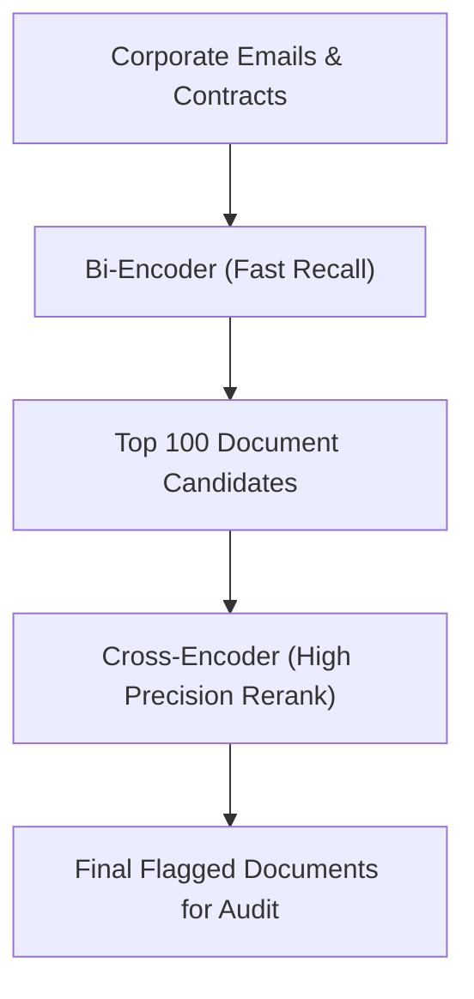

# Automated Corporate E-Discovery & Legal Audit Reranking

E-Discovery pipelines utilize semantic sentence/passage embeddings to automate audit and compliance scanning of unstructured corporate communications.

## Core Mechanism

[Back to README](../README.md)
