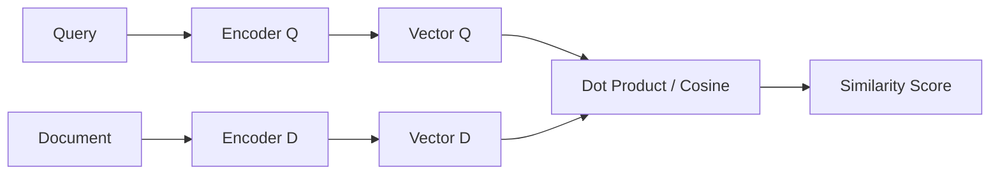

# Bi-Encoder Architectures (Dual-Tower Matching)

Bi-Encoder architectures utilize two separate (or shared-parameter) encoders to map queries and documents into a shared vector space, calculating similarity scores using simple dot products.

## Core Mechanism

## Pros & Cons

- **Pros:** Highly scalable; document vectors can be pre-computed offline and indexed in vector databases.
- **Cons:** No dynamic cross-attention between query tokens and document tokens during encoding.

[Back to README](../README.md)
