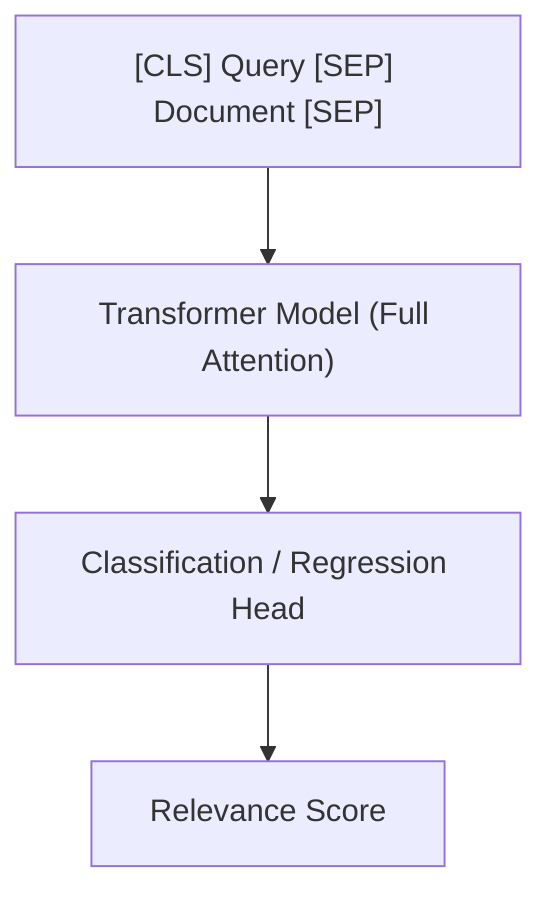

# Cross-Encoder Architectures (Full-Attention Fusion)

Cross-Encoder architectures process the query and document simultaneously by concatenating them and passing them through the transformer network together.

## Core Mechanism

## Comparison

- **Pros:** Extremely high accuracy due to full cross-attention between every token in the query and document.
- **Cons:** High latency; cannot pre-compute embeddings offline, making it impractical for first-stage retrieval on large datasets.

[Back to README](../README.md)
