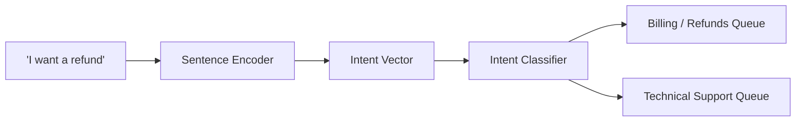

# Omni-Channel Customer Intent Routing Platforms

Intent routing platforms convert incoming customer service queries into dense intent vectors to instantly sort and assign tickets.

## Core Mechanism

[Back to README](../README.md)
