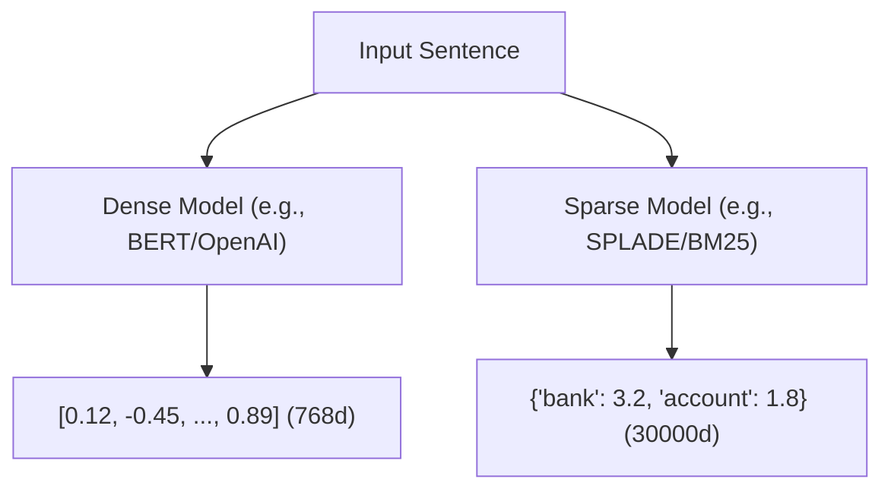

# Dense vs. Sparse Embedding Models

Modern search engines often combine dense and sparse representations to balance keyword match precision with conceptual semantic understanding.

## Core Mechanism

- **Dense Models:** Generate low-dimensional, continuous floating-point vectors (e.g., 768 or 1536 dimensions) capturing abstract meaning.
- **Sparse Models:** Generate high-dimensional, vocabulary-aligned vectors where most values are zero (e.g., mapping to vocabulary token weights like SPLADE).

[Back to README](../README.md)
