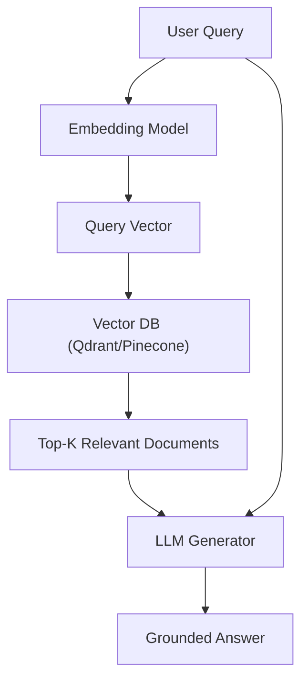

# Enterprise Retrieval-Augmented Generation (RAG)

Retrieval-Augmented Generation (RAG) integrates search retrieval databases with large language models to ground generation in factual context.

## Core Mechanism

[Back to README](../README.md)
