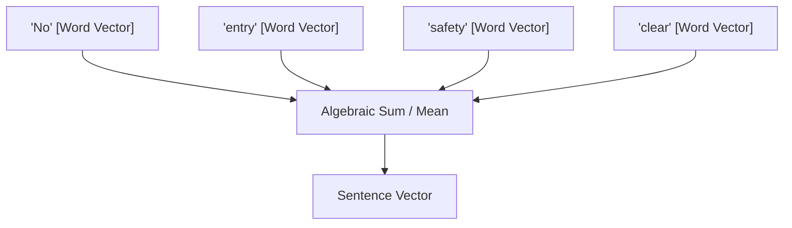

# The Flat Aggregation Era (Bag-of-Words & Vector Averaging)

The Flat Aggregation Era (~2013–2016) represents the foundational phase of sentence embeddings. During this period, sentence representations were constructed by aggregating individual word vectors without considering their sequential order or syntactic structure.

## Core Mechanism

The primary method involved taking pre-trained word embeddings (such as Word2Vec or GloVe) and computing their algebraic mean (average) or sum to represent the entire sentence.

## Limitations

- **Loss of Syntax/Order:** Reversing or scrambling the words yields the exact same representation. For example, `"No entry, safety clear"` and `"Clear entry, no safety"` result in identical vectors.
- **Polysemy Issues:** Words with multiple meanings are averaged out, losing contextual specificity.

[Back to README](../README.md)
