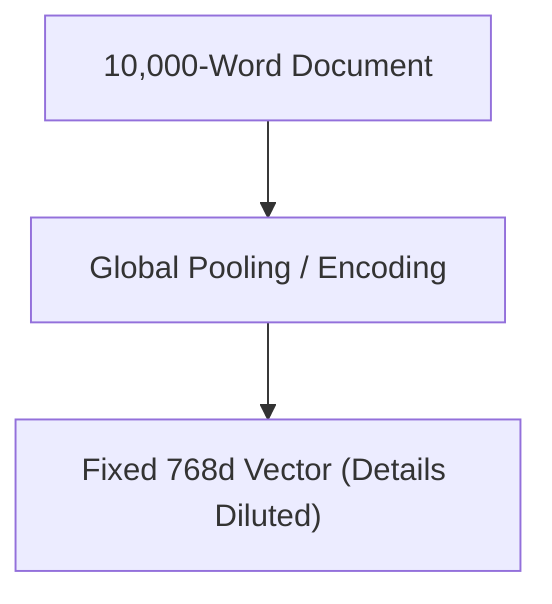

# The Long-Document Information Dilution (The Squashing Effect)

Forcing a long document (e.g., 10,000 words) into a single, fixed-size vector representation leads to structural information dilution or the "over-squashing" effect.

## Core Mechanism

Critical local details are washed out by average pooling layers or attention pooling across thousands of tokens.

## Mitigation

- **Parent-Child Chunking:** Split the document into small child chunks for retrieval, while returning the larger parent chunk to the generator model.

[Back to README](../README.md)
