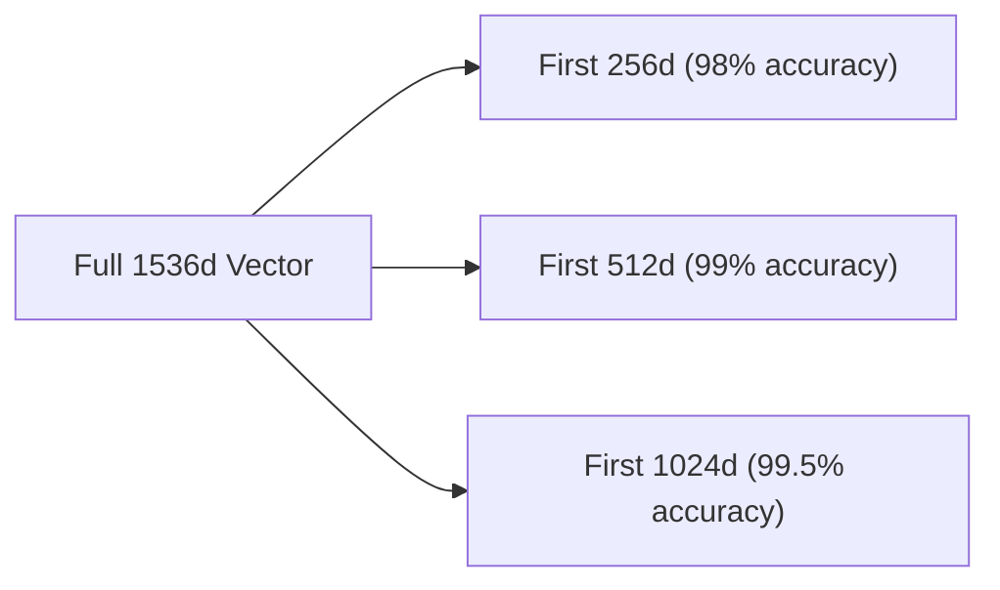

# Matryoshka Representation Learning (MRL)

Matryoshka Representation Learning (MRL) trains models to pack the most important semantic information into the early dimensions of the embedding vector.

## Core Mechanism

MRL trains the model on multiple nested sub-vectors concurrently, ensuring that truncation at smaller dimensions (e.g., 256 instead of 1536) retains high accuracy.

## Advantages

- Saves up to 80% on vector database storage.
- Dramatically speeds up downstream indexing and search calculations.

[Back to README](../README.md)
