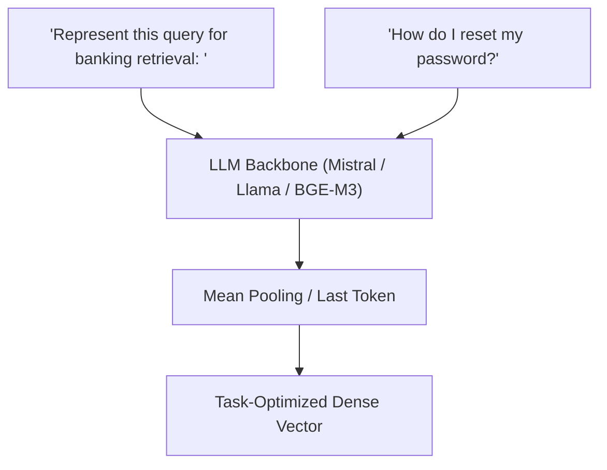

# The Multi-Task Instruction-Tuned & LLM Backbone Era

Modern sentence embedding models (2023–Present) leverage massive autoregressive language models (LLMs) and instruction-tuning to generate context-aware, task-specific representations.

## Core Mechanism

Rather than using a generic encoder, a prompt instructions prefix is prepended to the text to steer the representation space depending on the retrieval task.

## Key Characteristics

- **Zero-Shot Transfer:** Exceptional performance across unseen domains due to LLM base knowledge.
- **Dynamic Adaptability:** Prompts allow the same model to act as a symmetric/asymmetric retriever, classifier, or ranker.

[Back to README](../README.md)
