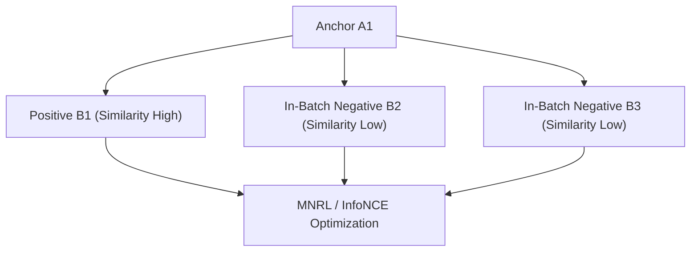

# Multiple Negatives Ranking Loss (MNRL / InfoNCE)

MNRL is a widely adopted contrastive learning objective that treats matched pairs in a batch as positives, and all other cross-pair combinations as negatives.

## Core Mechanism

For a batch of $(A_i, B_i)$ pairs, $B_j$ (where $j \neq i$) serves as a negative candidate for $A_i$.

[Back to README](../README.md)
