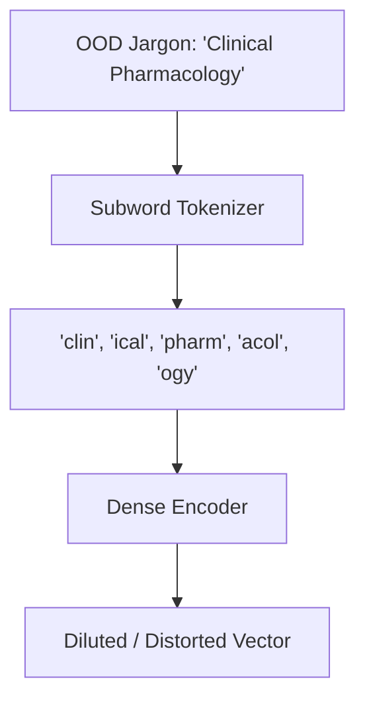

# The Out-of-Distribution Vocabulary Leak

Out-of-Distribution (OOD) shifts happen when semantic models encounter domain-specific jargon or abbreviations not present in their training corpus.

## Core Mechanism

Unseen terms get fragmented into subword tokens, leading to a loss of specific semantic meaning (e.g., "pharmacology" split into generic root words).

## Mitigation

- **Hybrid Search:** Combine dense vectors with sparse keyword index (BM25 or SPLADE).
- **RRF:** Merge dense and sparse lists using Reciprocal Rank Fusion.

[Back to README](../README.md)
