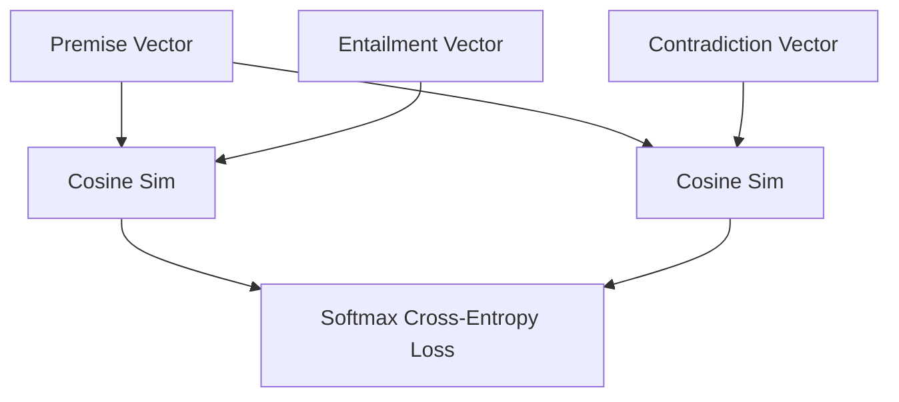

# Pairwise Softdev Cross-Entropy Loss

Commonly used in supervised sentence embedding training, particularly with Natural Language Inference (NLI) datasets consisting of premises, entailments, and contradictions.

## Core Mechanism

The network optimizes the embeddings such that the cosine similarity between the premise and entailment is maximized while the similarity between the premise and contradiction is minimized.

[Back to README](../README.md)
