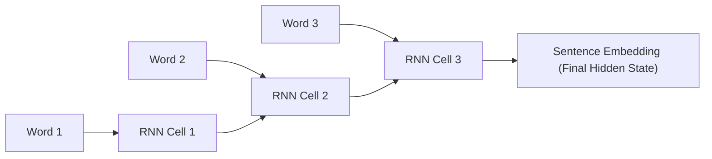

# The Sequential Recurrent & Supervised Task Era

Transitioning from flat averaging (~2016–2019), this era leveraged deep sequence models like Recurrent Neural Networks (RNNs), Long Short-Term Memory (LSTM) networks, and Gated Recurrent Units (GRUs) to encode sentences sequentially.

## Core Mechanism

The sentence is processed token-by-token. The hidden state at the final step (or a max-pooled representation across steps) serves as the sentence embedding. Models like **InferSent (2017)** were trained on supervised Natural Language Inference (NLI) tasks to learn high-quality embeddings.

## Advantages & Limitations

- **Advantage:** Captures sequential order and temporal dependencies.
- **Limitation:** Sequential processing bottlenecks GPUs, capping performance and scalability for long documents.

[Back to README](../README.md)
