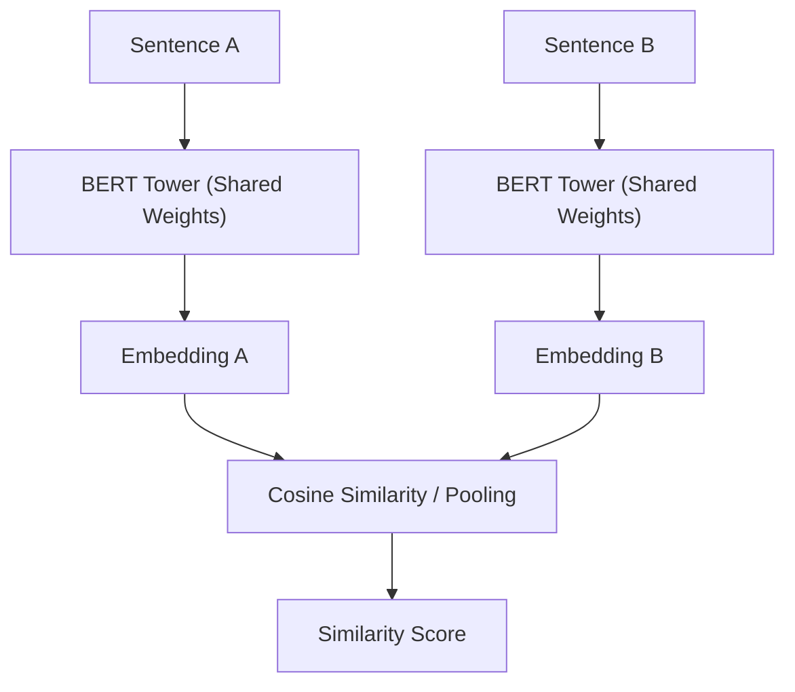

# The Siamese Bi-Encoder Transformer Revolution (SBERT)

Introduced in 2019 by Reimers & Gurevych, Sentence-BERT (SBERT) adapted pre-trained BERT architectures for efficient sentence-pair scoring using a Siamese network configuration.

## Core Mechanism

Two identical BERT towers (sharing weights) process two sentences independently. A contrastive pooling strategy and pooling layers optimize the cosine similarity between their embeddings.

## Significance

- **Speed:** Reduced semantic search over 10 million sentences from 65 hours to under 5 milliseconds.
- **Production Standard:** Standardized dense vector search architectures in databases like Pinecone, Milvus, and Qdrant.

[Back to README](../README.md)
